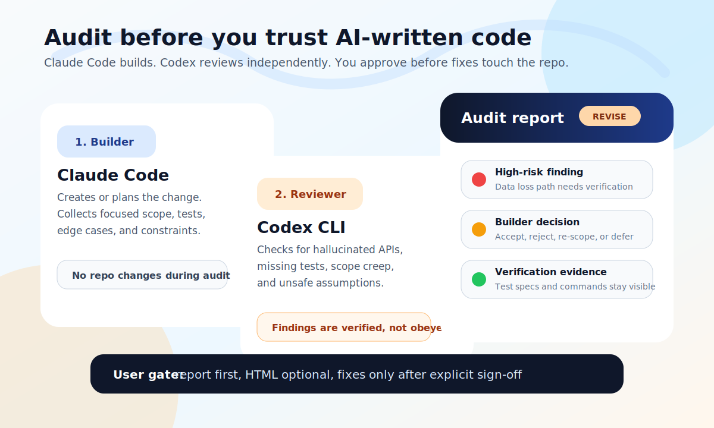
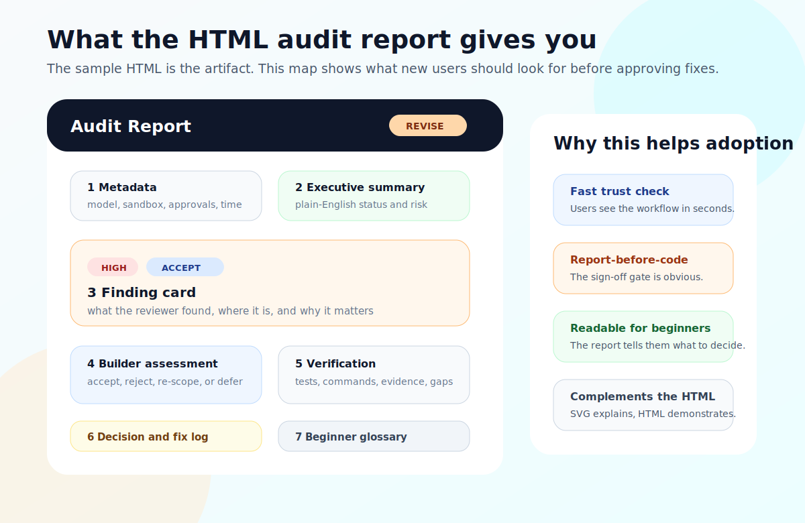

# Adversarial Reviewer Lite

Lightweight, Windows-friendly adversarial code review for people building products with AI coding agents.

Adversarial Reviewer Lite is a **Claude Code skill** for developers who use AI coding tools to build real products and want a systematic safety net before trusting AI-generated changes. Claude Code remains the builder. Codex CLI is called as an independent adversarial reviewer. The skill passes focused code context and test expectations to Codex, shows the reviewer output, helps the builder explain each finding with domain knowledge, and presents a readable audit report before any fixes are applied.

This is not for trivial scripts or first-day experiments with AI coding. It is for the stage where you are building something that matters — an app, an API, a product — and want an independent check before AI-generated code ships. If you are changing auth, data writes, billing, migrations, multi-file refactors, or anything where a hallucinated API or missing edge case would cost real time, this workflow is for you.

The first release is intentionally narrow: Claude Code builder, Codex reviewer, one-pass audit, Windows-aware defaults, and user sign-off before code changes. Many developers building with AI coding tools are on Windows, where Linux-style sandboxing can fail with `bwrap`/bubblewrap errors, and they need a small workflow that reduces hallucination, scope creep, and unverified "looks good" summaries.



The preview above shows the workflow promise: a report-before-code audit, not just a raw second-agent opinion.

Suggested public repo name:

```text
adversarial-reviewer-lite
```

Current skill invocation:

```text
/adversarial-reviewer-lite audit
```

If you install the skill folder under another name, Claude Code uses that folder name as the slash command. For example, installing it as `~/.claude/skills/adversarial-reviewer-lite/` gives `/adversarial-reviewer-lite audit`.

Golden rule:

```text
Build with Claude. Before you trust the change, run:
/adversarial-reviewer-lite audit
```

Claude Code may not reliably prompt you to use this skill automatically. Treat it as a deliberate review habit: after Claude writes a plan, changes code, or claims a fix is done, manually invoke the audit.

## One-Minute Install

Clone the repo:

```bash
git clone https://github.com/razaumair2203-ux/adversarial-reviewer-lite.git
cd adversarial-reviewer-lite
```

Install the skill on macOS/Linux/Git Bash:

```bash
bash scripts/install.sh
```

Install the skill on Windows PowerShell:

```powershell
powershell -ExecutionPolicy Bypass -File .\scripts\install.ps1
```

If PowerShell scripts are blocked by policy and you cannot change it, copy the skill folder manually:

```powershell
$dest = "$env:USERPROFILE\.claude\skills\adversarial-reviewer-lite"
if (Test-Path $dest) { Remove-Item $dest -Recurse -Force }
Copy-Item -Recurse "skills\adversarial-reviewer-lite" $dest
```

Restart Claude Code if it was already open. On Windows, make sure Claude Code is using Git Bash or WSL as its shell before invoking the audit — the skill requires a bash-compatible shell at runtime.

```text
/adversarial-reviewer-lite audit
```

Optional habit reminder: copy [snippets/claude-md-reminder.md](snippets/claude-md-reminder.md) into your project's `CLAUDE.md`.

Optional Git hook reminder: copy [snippets/post-commit-reminder.sample](snippets/post-commit-reminder.sample) to `.git/hooks/post-commit` and make it executable. It only prints a reminder; it does not run the audit.

The tested setup is:

- **Builder:** Claude Code
- **Reviewer backend:** Codex CLI
- **Default reviewer model:** `gpt-5.5`

The underlying terms `builder`, `reviewer`, and `review_backend` keep the design portable later, but the first public release is not trying to support every agent stack.

Author's note: this workflow was developed using Claude Code as the builder and Codex as the reviewer. In my own projects, that split significantly improved review quality because the reviewer caught mistakes, scope drift, weak tests, and unverified claims the builder was more likely to miss.

## Repository Structure

```text
adversarial-reviewer-lite/
  README.md
  LICENSE
  .gitignore
  scripts/install.sh
  scripts/install.ps1
  skills/adversarial-reviewer-lite/SKILL.md
  skills/adversarial-reviewer-lite/references/runner.md
  snippets/claude-md-reminder.md
  snippets/post-commit-reminder.sample
  docs/assets/audit-report-preview.svg
  docs/assets/audit-report-preview.jpg
  docs/assets/audit-report-anatomy.svg
  docs/assets/audit-report-anatomy.jpg
  docs/windows-sandbox.md
  docs/how-to-use.md
  docs/no-codex-yet.md
  docs/troubleshooting.md
  docs/release-checklist.md
  docs/launch.md
  docs/linkedin-post.md
  docs/why-independent-review.md
  docs/safety-model.md
  examples/sample-review.md
  examples/sample-audit-report.html
```

- `skills/adversarial-reviewer-lite/SKILL.md` is the main Claude Code skill. It defines invocation options, safety checks, the audit workflow, evaluation discipline, and terminal summaries.
- `skills/adversarial-reviewer-lite/references/runner.md` is the Codex-specific reviewer backend contract. It launches Codex CLI, validates output, classifies review quality, and returns JSON to the main skill.
- `scripts/` installs the skill folder into your Claude Code skills directory.
- `snippets/` contains optional reminder snippets. Nothing is installed automatically.
- `docs/assets/audit-report-preview.svg` is the README hero image for the audit workflow.
- `docs/assets/audit-report-preview.jpg` is the LinkedIn-friendly version of the hero image.
- `docs/assets/audit-report-anatomy.svg` maps the HTML report sections for new users.
- `docs/assets/audit-report-anatomy.jpg` is the LinkedIn-friendly version of the report anatomy image.
- `docs/windows-sandbox.md` explains why Windows often needs different sandbox handling.
- `docs/how-to-use.md` explains cloning, installing, invoking, and when to prefer the skill over a manual second-agent review.
- `docs/no-codex-yet.md` gives a manual trial path for users who have not installed Codex CLI yet.
- `docs/troubleshooting.md` is a symptom/fix table.
- `docs/release-checklist.md` and `docs/launch.md` help publish and share the repo.
- `docs/linkedin-post.md` is a public launch-post draft for non-specialist audiences.
- `docs/why-independent-review.md` explains the builder/reviewer split and the research/practice rationale.
- `docs/safety-model.md` lists the trust boundaries, controls, and known limits.
- `examples/` shows what reviewer output and the optional audit report look like.

## Why This Exists

Coding agents are useful, but they can still:

- cite APIs or packages that do not exist;
- over-expand the task beyond the user's request;
- pass their own flawed assumptions into tests or explanations;
- apply review feedback too obediently, even when the reviewer is wrong.

Adversarial Reviewer Lite adds a small audit workflow:

1. The user invokes `/adversarial-reviewer-lite audit`.
2. The builder collects the plan/code scope plus focused test data or test specifications.
3. Codex reviews as an independent auditor.
4. The reviewer output is shown verbatim.
5. The builder validates each reviewer observation instead of obeying it blindly.
6. Before touching code, the builder presents a beginner-readable report and offers/saves the HTML audit artifact.
7. The user signs off before any fixes are applied.

It reduces risk. It does not guarantee correctness.

## When To Run It

Run:

```text
/adversarial-reviewer-lite audit
```

after Claude Code:

- finishes a non-trivial code change;
- proposes a plan you are about to approve;
- touches auth, data writes, migrations, billing, file deletion, background jobs, or permissions;
- says tests passed but you want a second model to inspect the verification;
- makes changes across multiple files;
- explains an API, CLI flag, package, or framework behavior you are not sure exists;
- starts expanding scope beyond what you asked for.

You probably do not need it for tiny typo fixes, comments, or purely cosmetic edits.

## Copy-Paste Prompts

Basic audit:

```text
/adversarial-reviewer-lite audit
```

Audit a specific file:

```text
/adversarial-reviewer-lite audit path/to/file.ts
```

Audit against focused test expectations:

```text
/adversarial-reviewer-lite audit test-spec:docs/change-tests.md
```

Audit with edge-case fixtures:

```text
/adversarial-reviewer-lite audit test-spec:docs/change-tests.md test-data:fixtures/change-cases.json
```

If your account cannot use the default reviewer model:

```text
/adversarial-reviewer-lite audit reviewer:<your-codex-model>
```

## Why A Skill Instead Of A Second Chat Window?

You can open a separate Codex or Claude window and ask it to review your code. That is better than no review, but it is easy to forget important guardrails.

The skill makes the review repeatable:

- it uses the same audit-first prompt structure every time;
- it passes focused test specs and sample data when available;
- it warns before repo content goes to an external reviewer;
- it preflights the requested Codex model;
- it handles Windows sandbox defaults explicitly;
- it records Git and dirty-file hashes before/after reviewer dispatch;
- it requires `VERDICT: APPROVED` or `VERDICT: REVISE`;
- it separates reviewer suggestions from builder decisions;
- it can produce a consistent HTML audit report.

The benefit is not that the skill is smarter than a human prompt. The benefit is that it is harder to accidentally skip the boring safety steps that matter when an AI is reviewing another AI's work.

## How The Flow Works

1. The user invokes `/adversarial-reviewer-lite audit`.
2. The skill detects platform and Git repo state.
3. The user sees a privacy notice before repository context is sent to the reviewer backend.
4. The builder gathers a focused review bundle: plan/code diff, relevant files, test specifications, edge cases, expected behavior, known constraints, and sample test data when available.
5. The skill captures repo mutation snapshots: Git status, dirty-file list, and dirty-file content hashes.
6. Codex model preflight checks whether the requested reviewer model is available.
7. The builder creates a reviewer prompt with the selected scope, focused test expectations, and strict auditor instructions.
8. The skill hashes prompt inputs after the prompt body exists and immediately before dispatch.
9. The Codex runner launches the reviewer with the configured model, reasoning, sandbox, and approval policy.
10. The runner validates the review, extracts `VERDICT: APPROVED` or `VERDICT: REVISE`, and classifies review quality.
11. The main skill compares pre/post mutation snapshots before any fixes are allowed.
12. The reviewer output is shown verbatim.
13. The builder evaluates each finding using the matrix: accept, reject, re-scope, or defer.
14. The builder presents the audit report and HTML report option before touching code.
15. Only after user sign-off may the builder apply verified accepted/re-scoped fixes.
16. Every terminal state ends with a beginner-readable summary of findings, verification, rejected observations, structural concerns, and remaining risks.

## What Good Looks Like

A useful audit should give you:

- raw reviewer findings;
- a builder-side decision for each finding: accepted, rejected, re-scoped, deferred, or needs verification;
- evidence for tool/API/config claims when practical;
- a clear statement of what will be changed, if anything;
- an optional HTML report before fixes;
- no code changes until you sign off.

If the output is mostly sandbox errors, generic advice, or praise, treat it as not verified and fix the setup or prompt scope before trusting it.

## Skill File Versus Runner

`SKILL.md` is the workflow brain. Claude Code reads it when the user invokes the skill. It tells Claude how to collect scope, warn about privacy, build the reviewer prompt, evaluate findings, ask for sign-off, and create the audit report.

`references/runner.md` is the backend contract. A short-lived subagent reads it to launch Codex CLI, write the raw review to a temp file, validate the final verdict, classify review quality, and return JSON to the main skill. The runner does not edit project files and does not apply fixes.

## Quick Start

1. Install this skill.

   ```bash
   bash scripts/install.sh
   ```

   Or on Windows PowerShell:

   ```powershell
   powershell -ExecutionPolicy Bypass -File .\scripts\install.ps1
   ```

2. Install Codex CLI and authenticate it.

   ```bash
   npm install -g @openai/codex
   codex --version
   codex login
   codex doctor --summary
   ```

3. Make sure the shell Claude Code uses can run the required local tools.

   ```bash
   git --version
   codex --version
   timeout --version
   grep --version
   tail --version
   sort --version
   sha256sum --version || shasum --version
   ```

   On Windows, Git Bash or WSL is required for running audits because the skill uses POSIX commands (`timeout`, `grep`, `tail`, `sort`, `sha256sum`) and bash syntax throughout. The skill will stop with an error if the shell is not bash-compatible.

4. Confirm the skill folder exists.

   ```text
   ~/.claude/skills/adversarial-reviewer-lite
   ```

5. Invoke it from Claude Code.

   ```text
   /adversarial-reviewer-lite audit
   ```

6. Optional overrides:

   ```text
   /adversarial-reviewer-lite audit reviewer:gpt-5.5 reasoning:xhigh
   /adversarial-reviewer-lite audit test-spec:tests/profile-save.spec.md
   /adversarial-reviewer-lite audit test-data:fixtures/profile-edge-cases.json
   /adversarial-reviewer-lite audit sandbox:inherit approvals:never
   ```

See [docs/how-to-use.md](docs/how-to-use.md) for clone/install options and examples.

If you do not have Codex CLI yet, see [docs/no-codex-yet.md](docs/no-codex-yet.md).

## Habit Checklist

Before accepting an AI-generated change:

- Did I run `/adversarial-reviewer-lite audit`?
- Did I provide test expectations or edge cases if they matter?
- Did the reviewer produce `VERDICT: APPROVED` or `VERDICT: REVISE`?
- Did the builder reject or re-scope weak reviewer advice instead of blindly obeying it?
- Did I approve fixes only after seeing the report?

## Optional Reminders

To make the habit stick, you can paste [snippets/claude-md-reminder.md](snippets/claude-md-reminder.md) into a project's `CLAUDE.md`. This tells Claude to suggest the audit after non-trivial changes, but not to run it automatically.

You can also install the sample post-commit reminder:

```bash
cp snippets/post-commit-reminder.sample .git/hooks/post-commit
chmod +x .git/hooks/post-commit
```

The hook only prints a reminder. It does not call Codex and does not send repo context anywhere.

## V1 Scope

- **Audit mode:** recommended v1 path. One reviewer pass, builder validates findings, report/HTML is presented, user signs off before fixes.
- **Plan/code scope:** supported inside audit. The builder can include a plan, code diff, or both in the audit bundle.
- **One-pass audit only in v1:** repeated fix/review rounds are intentionally out of scope for the first release.

## Test Specs And Test Data

The best audits are exhaustive but focused. Give the builder enough test intent to pass to Codex:

- expected behavior;
- edge cases;
- sample inputs and outputs;
- regression cases;
- commands the project normally uses for validation;
- test files or fixtures that matter;
- scenarios that must stay out of scope.

Example:

```text
/adversarial-reviewer-lite audit test-spec:docs/profile-save-tests.md test-data:fixtures/profile-cases.json
```

The reviewer should use this information to check whether the plan/code has enough verification. The builder still decides what is valid before touching code.

## Core Safety Discipline

Adversarial Reviewer Lite deliberately does not trust either agent blindly.

- Reviewer output is shown verbatim before fixes.
- The audit report is presented before code is touched.
- Every finding goes through an evaluation matrix.
- Tool, CLI, package, config, and API claims need empirical verification when practical.
- Structural changes, such as workflow, sandbox, approval, data, or architecture changes, require a user gate unless the user explicitly asked for autonomous fixing.
- The builder may accept, reject, re-scope, or defer reviewer findings.
- Terminal summaries explain what changed, what was verified, what was rejected, and what risk remains.

This is the main difference between a useful review workflow and a dangerous "AI told AI to change code" workflow.

## Comparison

| Approach | Good For | Main Gap |
|---|---|---|
| Manual second chat window | Quick informal review | Easy to forget privacy, mutation checks, strict verdicts, and sign-off. |
| PR review bots | Team pull-request workflows | Usually runs later, often after code is already pushed. |
| Same-agent self-review | Fast sanity check | Shares context and assumptions with the builder. |
| Adversarial Reviewer Lite | Local pre-trust audit of Claude Code work | Requires Codex CLI and deliberate invocation. |

## Windows Notes

Codex sandboxing often relies on `bwrap`/bubblewrap. That works on many Linux setups and fails on most Windows setups. Adversarial Reviewer Lite detects Windows and uses `danger-full-access` by default unless you explicitly override it. This is a practical workaround for the Windows sandbox limitation, not a claim that full access is safer.

That sounds scary because it is real power. The skill compensates with:

- explicit reviewer instructions not to edit project files;
- pre/post Git mutation snapshots;
- dirty-file content hashing;
- approval policy controls to avoid hidden nested-review hangs;
- human sign-off before audit-mode fixes;
- visible warnings before external review.

Read [docs/windows-sandbox.md](docs/windows-sandbox.md) before using it on sensitive repos.

## Safety Model

Adversarial Reviewer Lite is a review workflow, not a security boundary.

It helps catch:

- hallucinated APIs and dependencies;
- missing error handling;
- data-loss risks;
- scope creep;
- unverified claims;
- hidden assumptions in plans.

It does not make generated code automatically safe. See [docs/safety-model.md](docs/safety-model.md).

## Built-In Preflight Checks

Before it dispatches the reviewer, the skill should stop cleanly if:

- Git is missing or the current folder is not a Git worktree;
- Codex CLI is not installed or not on `PATH`;
- Codex health/auth/config checks fail when `codex doctor` is available;
- the requested reviewer model is unavailable;
- required shell tools such as `timeout`, `grep`, `tail`, `cat`, `sort`, and a SHA-256 hash tool are missing;
- the temp directory cannot be created outside the repo;
- Windows sandbox settings would fail because `bwrap` is unavailable.

These checks are there so a missing Codex install becomes a helpful setup message, not a confusing failed review.

If a prerequisite is missing, the skill does not dispatch Codex and does not send repository content anywhere. It shows a setup-needed message with the missing tools and install guidance, then stops. It should only run an install command after explicit user approval.

## Troubleshooting

If the slash command does not appear:

- confirm the installed folder is `~/.claude/skills/adversarial-reviewer-lite`;
- confirm `SKILL.md` is directly inside that folder;
- restart Claude Code;
- invoke the exact command: `/adversarial-reviewer-lite audit`.

If the skill says Codex is missing:

- run `codex --version`;
- run `codex login`;
- run `codex doctor --summary`;
- reopen Claude Code if installing Codex changed your `PATH`.

If Windows sandboxing fails:

- read [docs/windows-sandbox.md](docs/windows-sandbox.md);
- use the default Windows behavior first;
- only override sandbox settings if you understand your Codex CLI setup.

For a fuller table, see [docs/troubleshooting.md](docs/troubleshooting.md).

## Configuration Defaults

| Setting | Default |
|---|---|
| Reviewer backend | `codex` |
| Reviewer model | `gpt-5.5` |
| Reasoning | `xhigh` |
| Unix/macOS sandbox | `workspace-write` |
| Windows sandbox | `danger-full-access` with warning |
| Approval mode | `auto_review` |
| Recommended mode | `audit` |
| Builder | Claude Code |

Future versions can generalize to other builders/reviewers. The first release is deliberately focused on Claude Code plus Codex CLI.

## Audit Reports

Audit mode presents a conversation report and can produce a self-contained HTML report after user consent. The report step happens before any code changes. The canonical minimal template is [examples/sample-audit-report.html](examples/sample-audit-report.html). Reports should include:



- metadata;
- status badge;
- severity and decision badges;
- executive summary;
- finding cards;
- builder assessment;
- verification evidence;
- glossary;
- update log.

The SVG is a visual reading guide. The HTML file is the concrete sample artifact users can open, inspect, adapt, and compare against their own generated report.

## Research Background

The workflow is inspired by research and practice around external feedback, self-refinement, multi-agent debate, and agentic code review. The short version: asking the same model to critique itself can help, but self-correction without external feedback is unreliable, and independent review creates a different failure surface. The builder still needs to verify findings.

Useful anchors:

- Self-Refine shows that feedback-and-refinement can improve outputs, even when a single model plays multiple roles: https://arxiv.org/abs/2303.17651
- Huang et al. report that LLMs can struggle to self-correct reasoning without external feedback, sometimes degrading answers: https://arxiv.org/abs/2310.01798
- Multi-agent debate research shows that multiple model instances can improve factuality and reasoning in some settings: https://arxiv.org/abs/2305.14325
- A 2026 vision paper on agentic code review argues for specialized agents plus human-controlled quality gates: https://arxiv.org/abs/2605.17548
- A 2025 code-review evaluation found that LLM review reliability depends heavily on context and task type, which supports passing focused test expectations instead of asking for generic review: https://arxiv.org/abs/2505.20206

See [docs/why-independent-review.md](docs/why-independent-review.md).

## Examples

- [examples/sample-review.md](examples/sample-review.md)
- [examples/sample-audit-report.html](examples/sample-audit-report.html)

## Roadmap

- More reviewer backends.
- Optional multi-model jury mode.
- Smoke-test harness for sample repos.

## Sharing The Repo

Suggested GitHub topics and launch copy are in [docs/release-checklist.md](docs/release-checklist.md) and [docs/launch.md](docs/launch.md).

## License

MIT
